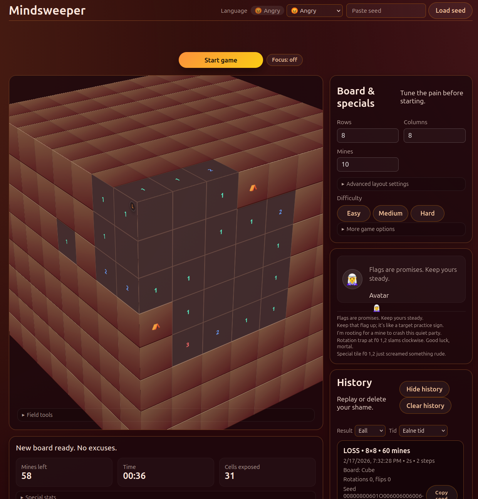
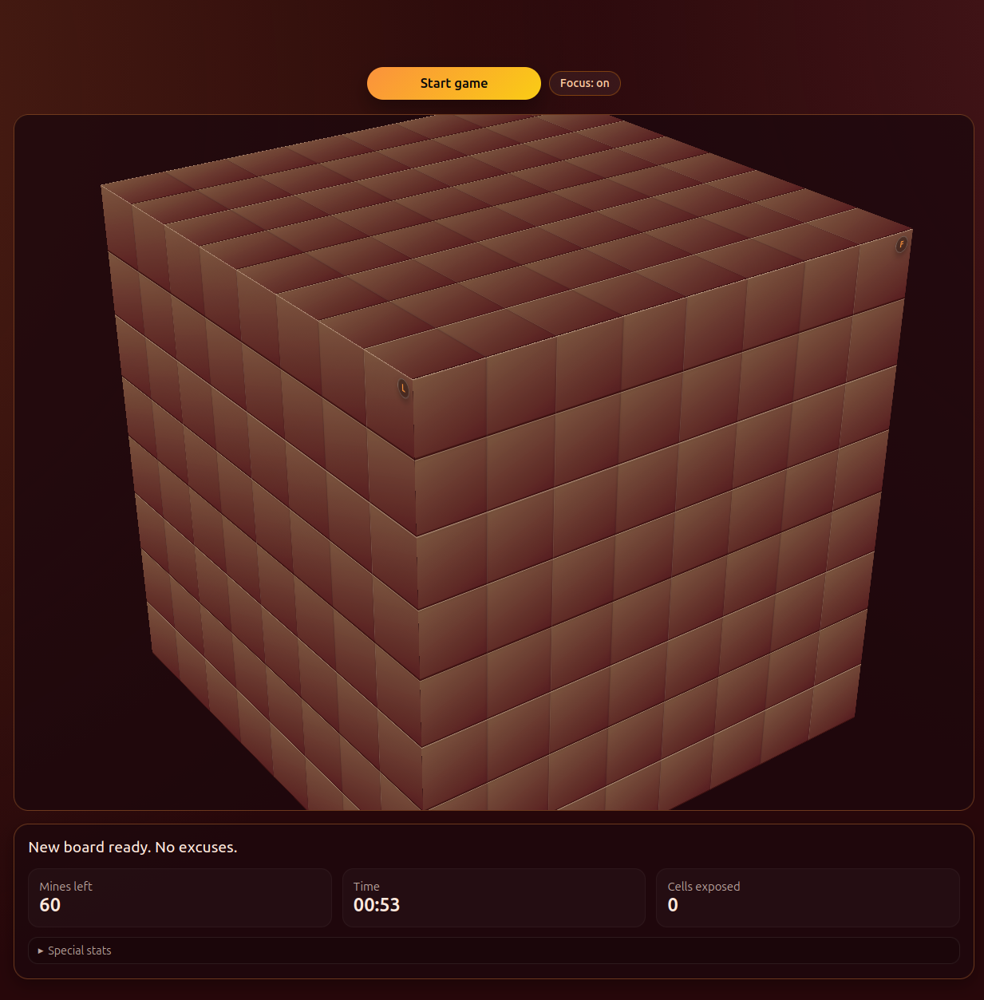

# Mindsweeper

**Mindsweeper** is a browser-only twist on Minesweeper: a single static page with keyboard-first controls, persistent history, replay tooling, configurable specials, and swappable renderers. It supports both a 3D cube board (`d6`) and a classic single-plane 2D board mode, while keeping the same reveal/flag/special systems.

## Start playing (recommended)

1. Download the latest release file: [mindsweeper-play.html](https://github.com/fda99940-alt/Battlegamev2/releases/latest/download/mindsweeper-play.html)
2. Open it in any modern browser.
3. Click **Start game**.

Watch out for special fields while playing:
- `⟳ Rotation`: rotates the board.
- `⇋ Flip`: mirrors the board.
- `🐶 Dog`: auto-flags a random unmarked mine.
- `🛡 Guardian`: gives a shield that blocks the next mine hit.

`mindsweeper-play.html` is self-contained and ready to run.





## Project structure (for contributors)

If you just want to play, use the release file above and skip this section.

- `dist/mindsweeper-play.html`: generated single-file distributable used for releases.
- `index.html`: source entry page used to generate the distributable build.
- `styles.css`: visual system that defines six palettes (Neon, Dusk, Sunrise, Midnight, Verdant, Ember), cube-face transforms, zero-gap grids, and responsive helpers so the board and controls stay tidy.
- `translations/locales/*.js`: each language lives in its own file that registers its localized strings plus the seed/share copy text on `window.MindsweeperTranslations.TRANSLATIONS` and `SEED_TERMS`.
- `translations.js`: aggregates the `LANGUAGE_OPTIONS` list, loads the per-locale registrations, augments theme names, and derives Braille output from English before exposing the bundle to the app.
- `renderers/domRenderer.js`: DOM renderer implementation (button-grid board creation, DOM-mode transforms, and DOM hit resolution).
- `renderers/canvasRenderer.js`: Canvas renderer implementation (face canvas creation, resize/draw pipeline, and canvas hit testing).
- `renderers/svgRenderer.js`: SVG renderer implementation (vector cell generation/sync, face SVG setup, and SVG hit testing).
- `renderers/webglRenderer.js`: WebGL renderer implementation (GPU fill pipeline, overlay labels, WebGL support probe, and WebGL hit testing).
- `renderers/three.vendor.js`: local bundled Three runtime used to expose global `THREE` without relying on a CDN.
- `renderers/threeRenderer.js`: Three.js renderer implementation (Three-powered face rendering, overlay labels, Three support probe, and hit testing).
- `modules/coreUtils.js`: shared utility helpers (clamping, seeded RNG, shuffle/pick helpers, formatting, and color helpers).
- `modules/historyStore.js`: history list filtering/rendering plus run/room-map persistence helpers.
- `modules/i18n.js`: locale selection, translation lookup, template replacement, and static text hydration.
- `modules/avatarCommentary.js`: avatar persona selection, commentary line resolution, speech pulse, and avatar history rendering.
- `modules/boardGeneration.js`: grid creation, mine/special placement, and neighbor count computation.
- `modules/boardActions.js`: reveal/flag actions, special-trigger flow, and helper actions like random mine flagging.
- `modules/boardTopology.js`: neighbor/edge transition logic across 2D and cube/poly-face boards.
- `modules/uiControls.js`: theme, history collapse, and preset UI wiring/state helpers.
- `modules/roomCodes.js`: room-code encode/decode, join-flow wiring, and clipboard copy helpers.
- `modules/polyhedronLayout.js`: cube face transform/layout helper used by renderer modules.
- `script.js`: top-level app orchestrator that composes modules, coordinates renderer mode/board mode/game lifecycle, and owns shared runtime state.
- `tests/*.test.js` + `tests/helpers/loadBrowserModule.js`: lightweight Node test harness for browser-style modules via VM loading.

## Running from source (contributors)

Open `index.html` in a modern browser. No server is required.

## Single-file build

To generate a distributable single HTML file with inlined/minified CSS and JS:

```bash
npm install
npm run build:single
```

Output file:

- `dist/mindsweeper-play.html`
- `dist/renderers/three.vendor.js` (copied local Three runtime loaded by the HTML build)

The build script uses `index.html` as source, inlines `styles.css`, inlines every `<script src="...">` in existing order, and minifies the result with `esbuild`.

### Refreshing local Three vendor bundle

This project loads Three from the local bundled file `renderers/three.vendor.js` (not a CDN).
After upgrading the `three` dependency, regenerate that bundle with:

```bash
npm run build:three-vendor
```

`renderers/three.vendor.entry.js` intentionally imports only the Three APIs used by this project so the vendor bundle stays smaller than exposing the full library globally.

## Testing

Run the lightweight Node test harness:

```bash
npm test
```

Current automated coverage focuses on:
- `modules/roomCodes.js` (lossless config encode/decode including `faces`, join flow behavior, clipboard callback behavior)
- `modules/boardTopology.js` (neighbor transition, invalid/edge handling, and de-dup logic)
- `modules/boardGeneration.js` + `modules/boardActions.js` (neighbor mine counts, reveal/flag state transitions, guardian/mine edge cases, cross-face rim/corner adjacency)

## Key features

1. **Keyboard-focused controls**: Arrow keys move focus, Enter/Space reveal, and F flags—every action works without a mouse.
2. **Mouse camera controls (3D mode)**: Left-drag orbits the board, and mouse wheel zooms in/out with a camera-depth transform (non-distorting) so perspective remains stable while inspecting dense layouts.
3. **Board mode switch**: Toggle between `Board: Cube` (3D dice-style board) and `Board: 2D` (single front-face plane). Switching mode starts a fresh board with mode-appropriate cell/mine limits.
4. **Renderer mode switch**: Choose `DOM`, `Canvas`, `SVG`, `WebGL`, or `Three.js` from the controls dropdown. `DOM` preserves native button-grid behavior, `Canvas` favors draw performance on bigger boards, `SVG` gives crisp scalable vector cells with class-based styling and easy hit testing, `WebGL` draws fast GPU-backed cell fills with an overlay label layer for clear numbers/icons, and `Three.js` uses a Three-powered render path with the same overlay interaction model.
5. **Cube-only 3D scaling**: 3D mode uses a fixed six-face cube (`d6`). Mines/specials inputs are still per-face values, multiplied by active faces (1 in `2D`, 6 in `Cube`) before a run starts.
6. **Difficulty presets**: Easy/Medium/Hard buttons seed the recommended inputs and immediately restart with that setup while highlighting the active preset.
7. **Rotation & flip fields**: Reveal specials to rotate the board or mirror it horizontally/vertically, and optionally disable these effects with “Specials: on/off”.
8. **Dog special tile**: Discovering a Dog tile flags a random unmarked mine automatically, so every good sniff buys you a little safety without touching the mine count input or flagging manually.
9. **Guardian special tile**: Stepping on a Guardian tile arms a temporary shield that automatically flags the next mine you would have hit, letting you recover without ending the run.
10. **Cheat view**: “Show mines” temporarily highlights raw mine locations and special tiles for inspection before you commit to a move.
11. **Neighbor debug inspector**: A `Debug: on/off` toggle under the board lists the currently hovered/focused cell neighbors (including cross-face seams) and highlights origin/neighbor cells directly on the board to verify adjacency behavior.
12. **History + replay**: Runs capture timestamps, configurations, board mode, layouts, mine positions, special trigger counts, and action sequences; the panel shows each run’s board type, and replay auto-switches to the corresponding mode before playback. In cube mode, replay camera motion follows each revealed cell so the active face stays in view. History supports result/date filters, paginated loading (`Show more`), and a bounded internal scroll area so long lists stay contained. Each entry also exposes a copyable room code plus a join form for instant replays.
13. **Seed sharing**: A deterministic seed string above the board encodes configuration (including `faces`) plus RNG state so the same board/special placement can be recreated by copying/pasting the seed (even into prompts). Clicking **Start game** intentionally rolls a fresh seed for the new board.
14. **Persistence**: LocalStorage keeps runs (`mindsweeperRuns`), board mode (`mindsweeperBoardMode`), renderer mode (`mindsweeperRenderer`), active theme (`mindsweeperTheme`), locale, focus mode (`mindsweeperFocusMode`), and history panel collapse state so your setup survives reloads.
15. **Localization-ready**: Every UI string routes through the `TRANSLATIONS` map; the dropdown shows flag + name, and selecting a new locale rewrites hero text, labels, hints, and status messages (including playful dialects like Klingon, Pirate, LOLcat, and Braille).
16. **Hero personas**: Multilingual hero text changes tone per locale, covering canonical translations plus fantasy/dialect voices (Yoda, Elvish, Melodia, Angry mode, etc.).
17. **Commentary avatar**: An above-board avatar narrates each move, keeps a rolling five-line conversation history, lets you choose between the polite guide, the evil heckler, the anime-inspired “cute” bunny, or the teasing anime girl, and tapping the portrait briefly reveals the dropdown so you can change voices without adding extra chrome.
18. **Avatar bios**:
    - **Friendly (🤖)**: Steady, encouraging narration that celebrates every safe reveal and flags each learnable pattern with calm optimism.
    - **Evil (😈)**: Taunting, dramatic commentary that enjoys every misstep and reminds you the mines are always hungry—good for players who enjoy contrarian banter.
    - **Cute (🐰)**: Sugary anime-style cheers, encouragement, and sparkle-filled whispers that treat every special as a confetti moment.
    - **Teasing (😜)**: Flirty, teasing remarks that pull no punches about the board’s drama and add extra flavor to any hot streak or failure.
    - **Megumin (🧙‍♀️)**: Explosion-obsessed spellcaster who narrates in bombastic, cosplay-ready bursts and treats every special tile as a stage for “Explosion!”
    - **Friren (🧝‍♀️)**: Calm, wandering mage with meditative, storybook commentary that steadies the pace and highlights quiet lessons even amid chaos.
19. **Face badges + visual polish**: Face icons now appear on rendered faces for quicker orientation, and covered cells in modern renderers have stronger depth/hover/press feedback.
20. **Special icon consistency**: Rotation, flip, dog, and guardian specials now use consistent icon markers across renderer modes for better readability.
21. **Win/loss polish**: Winning reveals every mine before declaring victory, matching the loss behavior so the board state is obvious either way.
22. **Focus mode**: A `Focus: on/off` toggle in the status strip hides non-essential chrome (hero, avatar, history, themes, debug helpers) to keep attention on board play and core controls.

## Future improvements

- Animate replay steps so specials and cascade reveals feel more dramatic.
- Add multiplayer room-code matchmaking or shared leaderboards for synchronized challenges.
- Introduce daily/weekly locked presets with modifiers to keep returning players engaged.
- Track best times per layout and show a mini leaderboard so you can chase personal records.

## Notes

- Built with help from an AI coding assistant (Codex, GPT-5) under human supervision, following the author’s guidance to shape the experience.
- Some translations are machine-generated; the author may not fully verify every language so take those localized strings with a grain of salt.
- 3D mode is intentionally cube-only (`d6`) to keep visual seams and neighbor transitions consistent.
